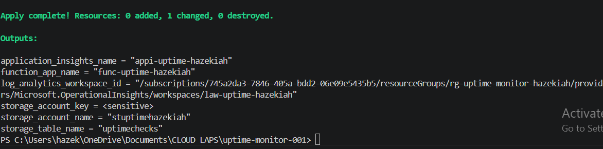
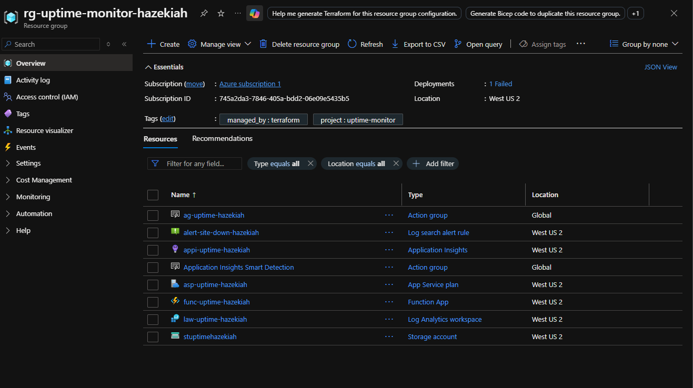
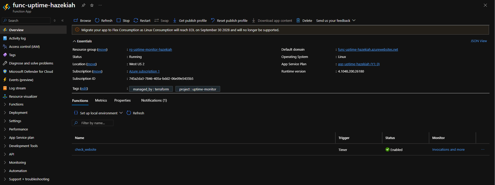
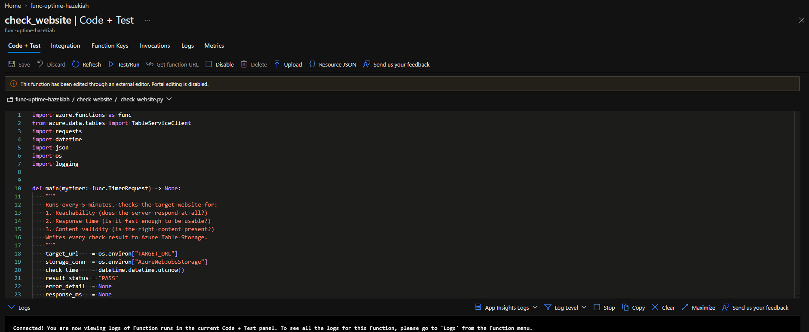
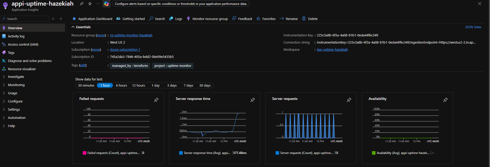
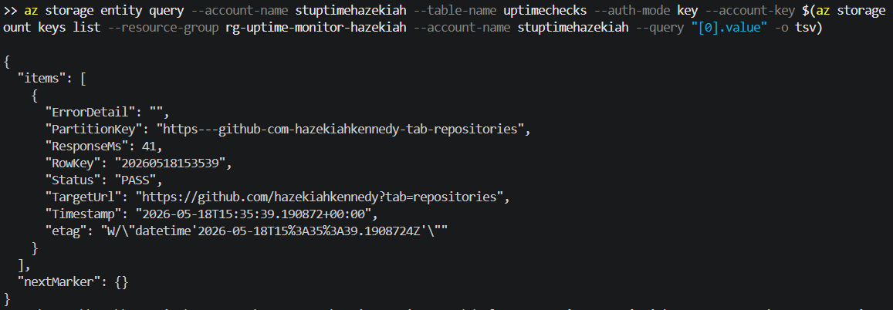
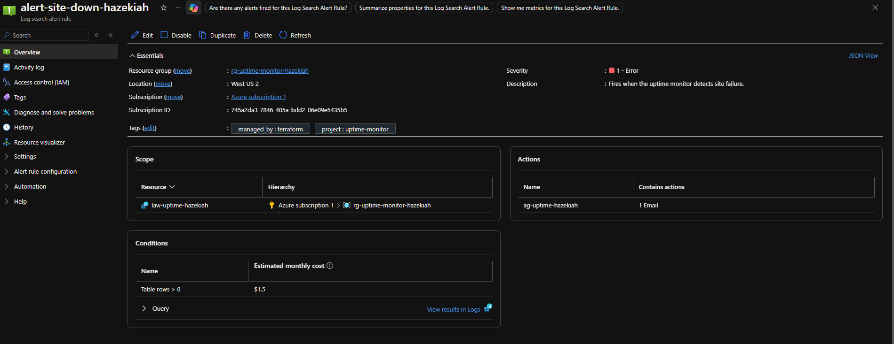
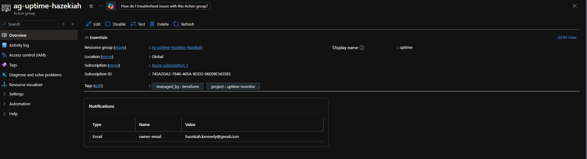

# Azure Website Uptime Monitor
**Platform:** Microsoft Azure  
**Author:** Hazekiah Kennedy  
**Tools:** Azure Functions · Table Storage · Application Insights · Azure Monitor · Terraform · Python

---

## What This Does

Deploys a serverless Azure Function that checks a target website every 5 minutes and records uptime/downtime results to Azure Table Storage. If the site goes down, an alert fires via email.

---

## Architecture

```
Timer Trigger (every 5 min)
    └── Azure Function (Python 3.12)
            ├── HTTP GET → Target Website
            ├── Write result → Table Storage (uptimechecks)
            └── Log → Application Insights
                        └── Alert Rule → Action Group (Email)
```

---

## Resources Deployed

| Resource | Name |
|---|---|
| Resource Group | rg-uptime-monitor-hazekiah |
| Storage Account | stuptimehazekiah |
| Function App | func-uptime-hazekiah |
| App Service Plan | asp-uptime-hazekiah (Y1 Consumption) |
| Application Insights | appi-uptime-hazekiah |
| Log Analytics Workspace | law-uptime-hazekiah |
| Alert Rule | alert-site-down-hazekiah |
| Action Group | ag-uptime-hazekiah |

---

## Screenshot Walkthrough

### 01 — Terraform Apply


### 02 — Resource Group


### 03 — Function App Running


### 04 — Function Listed


### 05 — Application Insights


### 06 — Table Storage Results


### 07 — Alert Rule


### 08 — Action Group


---

## Deploy

```bash
# 1. Fill in terraform.tfvars with your values
# yourname, target_url, alert_email

# 2. Deploy infrastructure
terraform init
terraform apply

# 3. Deploy function
cd deploy
func azure functionapp publish func-uptime-hazekiah --python
```

---

## Destroy

```bash
terraform destroy -auto-approve
```
